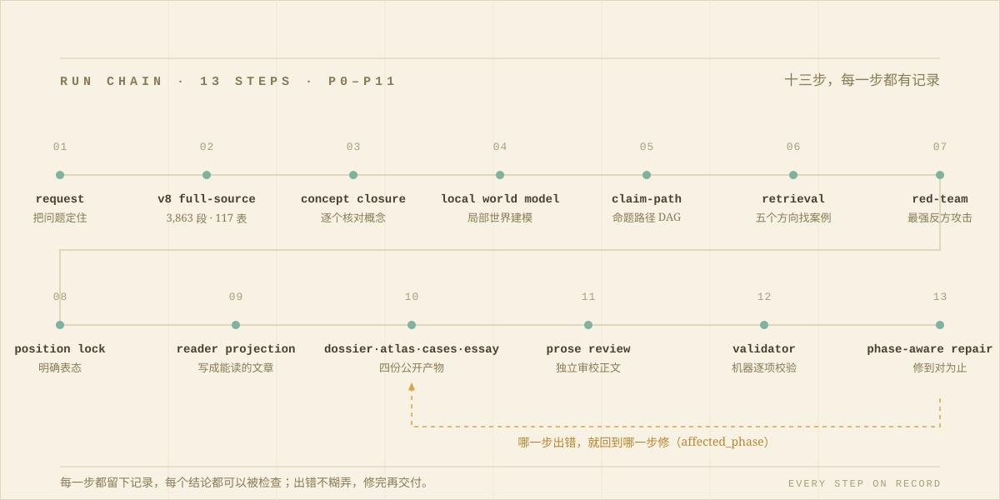

<div align="center">


# CrossFrame ProMax

### 可运行、可审计、可修复的重型 AI 结构推演系统

**它不是「让模型多想一会儿」的提示词，而是一套独立运行、全程留痕、出错可修的推演系统。**

<p><sub>它把 v8 全源知识、结构推演、真实检索、反方攻击、明确裁决、完整长文与机器验证，锁进同一次运行。</sub></p>

由 **CrossFrame 作者、ChatGPT 5.6 Sol（Ultra）与 Claude Fable 5（Ultracode）** 共同设计、实现、攻击与验证。

<p><sub>CrossFrame ProMax 属于更广泛的 CrossFrame Skill Suite 家族，同时是 v8-only、exact-name only 的独立 runtime；它不取代 Suite、Max 与其他专项 skills。</sub></p>


<p>
  <a href="skills/crossframe-promax/SKILL.md"><b>阅读 SKILL.md</b></a>
  &nbsp;·&nbsp;
  <a href="https://xi-kari.github.io/crossframe-skill/"><b>网页介绍</b></a>
  &nbsp;·&nbsp;
  <a href="https://github.com/xi-kari/crossframe-skill/releases"><b>下载 Release</b></a>
</p>

</div>

<table align="center">
<tr>
<td align="center" width="25%"><br><b>3,980</b><br>全源读取事件<br><sub>3,863 个段落 + 117 张表<br>每次读取留下 read event 与 hash</sub><br><br></td>
<td align="center" width="25%"><br><b>709 个概念</b><br>逐项处置<br><sub>定义、邻接、误用边界<br>说明进入或退出本次推演的理由</sub><br><br></td>
<td align="center" width="25%"><br><b>P0–P11</b><br>阶段状态机<br><sub>冻结、验证、定向修复<br>只重置受影响阶段及其下游</sub><br><br></td>
<td align="center" width="25%"><br><b>五向真实检索</b><br>案例校准<br><sub>支持与反例分开登记<br>断网时诚实降档</sub><br><br></td>
</tr>
</table>

> **共创边界：** ChatGPT 5.6 Sol（Ultra）参与了 ProMax skill 的架构设计、实现、攻击测试与验证；Claude Fable 5（Ultracode）承担了视觉系统（落地页与本 README）、仓库工程、跨平台校验与修复闭环；CrossFrame v8 的框架定义仍以作者提供的 v8 原始材料为权威。共创模型不是运行依赖，其他具备文件、Python 与可选网络能力的 Agent 型 AI 也可以调用。

<br>

<a id="s00"></a>

## 目录

<sub><b>CONTENTS · 这一页有什么</b></sub>

| § | 章节 | 一句话 |
| :-- | :-- | :-- |
| `§01` | [**不是提示词，是运行时**](#s01) | <sub>ProMax 与普通「深度思考」的分野</sub> |
| `§02` | [**一条可验证的运行链**](#s02) | <sub>十三步，每一步都留下记录</sub> |
| `§03` | [**八项能力，件件有记录**](#s03) | <sub>每一项能力都对应可检查的运行记录</sub> |
| `§04` | [**如何抑制模型自身风味**](#s04) | <sub>六道结构约束，差异只能暴露在证据里</sub> |
| `§05` | [**运行条件、消耗与触发边界**](#s05) | <sub>依赖、成本警告，与仅此四名的点名规则</sub> |
| `§06` | [**快速开始**](#s06) | <sub>克隆、安装、点名、验证</sub> |
| `§07` | [**CrossFrame Skill Suite 家族**](#s07) | <sub>16 个 skills：诊断、成文、评审与追问</sub> |
| `§08` | [**Max 模式**](#s08) | <sub>先搭好世界观再推演的重型模式，分四个运行档位</sub> |
| `§09` | [**ProMax 模式边界**](#s09) | <sub>与 Max 的隔离，独立的生成—反证—校验—修复闭环</sub> |
| `§10` | [**质量闭环与输出原则**](#s10) | <sub>每个判断都能被检查、追问和撤回</sub> |
| `§11` | [**文档与许可**](#s11) | <sub>从普通人版介绍到安全边界</sub> |

---

<a id="s01"></a>

## §01 · 不是提示词，是运行时

<sub><b>RUNTIME, NOT PROMPT</b></sub>

常见的「深度思考」，只是让模型在同一段上下文里多说几句。ProMax 走的是另一条路：**有状态、有工件、有验证闸。** 问题与 v8 源快照先被冻结；概念闭合、局部世界、命题路径与检索结果被登记为可检查的工件；初稿必须先接受最强反方的攻击、完成立场锁定，然后才由 reader projection 把整个审计闭包，投影成一篇普通读者能够进入的中文长文。

一次完整运行交付四份公开产物——dossier、concept atlas、cases 与纯读者 essay——外加内部的 prose review 与 manifest。正文不再转储审计台账；发布状态由独立校验报告决定，而不是由生成它的那个模型自己盖章。

<p align="right"><sub><a href="#s00">↥ 返回目录</a></sub></p>

<a id="s02"></a><a id="promax-runtime"></a>

## §02 · 一条可验证的运行链

<sub><b>RUN CHAIN · 13 STEPS · EVERY STEP ON RECORD</b></sub>



图上的十三步分成两段。前八步负责把判断做出来：冻结请求与源快照、读完全部材料、核对概念、建模局部世界、铺开命题路径、五个方向找案例，然后让最强反方攻击初稿——攻击结束后必须明确表态，「各有道理」不是出口。后五步负责把判断交付出去：reader projection 把审计结果写成普通读者能读的文章，物化 dossier、concept atlas、cases、essay 四份公开产物；整条链由六个角色接力完成，最后一个角色只负责审查当前正文，生成绑定 essay 与 P8/P9 锁的内部 prose review，随后由机器逐项校验。校验失败不是从头重来，而是依据 `affected_phase` 只重置受影响的步骤及其下游产物，修完再继续——不靠补几个关键词伪装完成。

<details>
<summary><sub>文本版运行链（无图环境）</sub></summary>

```text
request → v8 full-source → concept closure → local world model
        → claim-path → retrieval → red-team → position lock
        → reader projection → dossier + atlas + cases + essay
        → prose review → validator → phase-aware repair
```

</details>

<p align="right"><sub><a href="#s00">↥ 返回目录</a></sub></p>

<a id="s03"></a><a id="promax-capabilities"></a>

## §03 · 八项能力，件件有记录

<sub><b>CAPABILITIES · EVERY CLAIM ON RECORD</b></sub>

| 能力 | 运行约束 | 可审计结果 |
| :-- | :-- | :-- |
| **v8 全源加载** | 固定源快照；读取 **3,863 个段落、117 张表** | 每次读取形成 read event 与 hash，证明实际加载范围 |
| **概念闭合** | 对 **709 个概念**逐项登记定义、邻接概念、误用边界和与当前请求相关的理由 | 概念不能只被「提到」，必须说明如何进入或退出本次推演 |
| **局部世界建模** | 显式建模对象、行动者、圈层、尺度、双通道、时钟、事件、证据与未知项 | 分离已知、推断和待证部分，阻止把单一视角冒充全局 |
| **命题与路径** | 建立中心命题、竞争机制、路径 DAG、条件预测、切换条件与撤回条件 | 结论绑定可检验路径，不以修辞强度代替机制解释 |
| **真实检索** | 按五向检索搜寻案例、支持证据、反例和边界条件，并将支持与反例分开登记 | 有网络时外部校准；断网时诚实降档，不伪造来源或检索完成态 |
| **自我攻击** | 构造最强反方，检查概念误用、立场稳定性与证据截止 | 让反例真正有机会改写、降档或推翻初始判断 |
| **明确裁决** | 攻击后始终锁定立场；只有用户明确要求建议时，才比较六类行动并给出主方案、备选、停止条件与回滚路径 | 未要求建议时只完成明确判断，recommendation 闭合为 `{"status":"not_requested"}`，不自行制造方案 |
| **可验证交付** | 物化 dossier、concept atlas、cases、纯读者 essay、内部 prose review 与 manifest，再交给 fresh validator 和 phase repair | 四份公开产物共同承担完整性；正文不再转储审计台账，发布状态仍由独立校验报告决定 |

<p align="right"><sub><a href="#s00">↥ 返回目录</a></sub></p>

<a id="s04"></a><a id="model-flavor"></a>

## §04 · 如何抑制模型自身风味

<sub><b>MODEL FLAVOR SUPPRESSION · SIX STRUCTURAL CONSTRAINTS</b></sub>

不同 AI 有不同的训练偏好：有的倾向顺从，有的先反驳，有的习惯列举却不裁决。ProMax 不假设能抹去这些差异，而是用六道结构约束限制它们对判断与表达的支配：

1. **v8 定义优先。** 框架原文与概念契约覆盖模型预训练中碰巧同名的概念，禁止用熟悉词义替代 CrossFrame 的独特定义。
2. **冻结关键工件。** 请求、源快照、证据边界、命题和阶段产物被显式登记，防止推演中悄悄改题、换证据或移动判断标准。
3. **检索与 red-team 攻击草稿。** 真实案例检索和最强反方不是装饰性章节，而是可以迫使初稿改写、降档或撤回的独立步骤，不能只顺着用户说。
4. **position lock 强制裁决。** 模型在攻击后必须给出明确立场与判断撤回条件；只有用户明确要求建议时，才比较备选并登记停止与回滚条件。未要求建议时只完成判断，recommendation 为 `{"status":"not_requested"}`；不能用「各有道理」逃避判断。
5. **固定成文声口与读者投影。** ProMax 内置 50 张独立技法卡和九种体裁路由，每次只选 3 张核心卡与至多 2 张辅助卡。P9 把现实入口、中心命题、机制递进、同维比较、最强反方、明确立场、撤回与行动边界、余味结尾固定为八个有序动作，每个 reader beat 最多合并相邻两个；核心概念还要绑定 2–4 个逐字来自 v8 定义或允许推断的非通用锚词。正文既不自动迎合，也不为显得独立而自动反对。
6. **独立 prose review 与阶段修复。** 第六角色逐项审查现实入口、论证依赖、v8 概念保真、证据绑定、反方、公平比较、判断一致性、撤回边界、固定声口、宿主模型风味和审计泄漏；每个 beat 的审校映射必须保留动作 ID，并证明现实入口位于首个正文段、余味结尾位于最后一个正文段。fresh validator 只接受绑定当前字节的审校结果，失败后回到 P10 或其真实根因阶段。

这些约束不会让不同模型的措辞、节奏和全部判断变得字面完全相同，但它要求每个模型都通过同一套结构契约与审计闸；差异必须暴露在证据、路径、反例和撤回条件中，而不能藏在模型习惯里。

<p align="right"><sub><a href="#s00">↥ 返回目录</a></sub></p>

<a id="s05"></a><a id="promax-conditions"></a>

## §05 · 运行条件、消耗与触发边界

<sub><b>CONDITIONS &amp; COST · AN HONEST WARNING</b></sub>

| 项目 | 要求 |
| :-- | :-- |
| Python | **Python 3.11**（仓库 CI 基准） |
| 生产依赖 | `jsonschema` |
| 仓库验证 | `pytest`、`PyYAML` |
| 宿主能力 | 读取 skill 文件、执行 Python、写入独立 artifact 目录 |
| 网络 | 外部真实案例检索的可选能力；无网络时必须显式降档 |
| v8 材料 | 全源快照随 skill 携带，运行时不依赖原始 Word 文件 |

ProMax 是 v8-only、exact-name only 的独立 runtime，仅在用户明确使用以下四种名称之一时触发：`crossframe-promax`、`CrossFrame ProMax`、`$crossframe-promax`、`/crossframe-promax`。仅说「最大算力」「全尺度」或「穷尽推演」不构成 ProMax 点名，泛化最大化请求仍由 Max 承接；suite 不得自动升级。若 Max 与 ProMax 同时出现，ProMax 优先；一旦进入 ProMax，也不得降级回 Max。

> **消耗警告：** 基础完整轮次会连续读取 v8 全源，逐项处置 709 个概念，并执行检索、反方攻击、长文物化与验证修复；仅在用户明确要求建议时，才额外执行建议比较。完整运行可能消耗数百万至数千万 token。用户提供的一次 DeepSeek V4 Pro 完整单轮观察约为 **17,000,000 token**；它不是通用 benchmark、平均值或固定成本。请只在确实需要时显式点名，并预先确认模型额度、上下文续跑能力和成本上限。

<p align="right"><sub><a href="#s00">↥ 返回目录</a></sub></p>

<a id="s06"></a><a id="quickstart"></a>

## §06 · 快速开始

<sub><b>QUICKSTART · CLONE → INSTALL → INVOKE → VERIFY</b></sub>

克隆仓库：

```bash
git clone https://github.com/xi-kari/crossframe-skill
cd crossframe-skill
```

Codex 安装（Windows PowerShell / macOS &amp; Linux）：

```powershell
.\scripts\install-codex.ps1
```

```bash
bash scripts/install-codex.sh
```

Claude Code 项目内常用命令：

```text
/crossframe-suite 分析这个团队为什么复盘很多但没有真实修复
/crossframe-max 把这件事当作一个局部世界，做全尺度结构推演并写完整解释
/crossframe-promax 用 v8 框架穷尽分析这个判断，主动搜索反例并给出明确立场
/crossframe-essay 写一篇关于平台治理的中文评论文章
/crossframe-inquiry 基于刚才的文章继续追问反证和迁移条件
```

公开仓库日常验证：

```bash
python scripts/check_crossframe_skill_integrity.py --repo .
python scripts/check_source_continuity.py --materials-only --repo .
python -m json.tool skills/crossframe/schemas/claim-ledger.schema.json
python -m pip install jsonschema
python scripts/validate_claim_ledger_schema_fixtures.py --repo .
python scripts/check_crossframe_max_v6_full_source.py --repo . --source-docx <path-to-v6-docx> --allow-source-path-mismatch
python scripts/check_crossframe_max_v6_registry_anchors.py --repo .
python scripts/validate_crossframe_max_route_ledger_fixtures.py
python scripts/validate_crossframe_max_repair_fixtures.py
python scripts/sync_skill_mirrors.py --check
bash -n scripts/install-codex.sh
python -m py_compile scripts/*.py
git diff --check
```

完整上手说明见 [docs/QUICKSTART.md](docs/QUICKSTART.md)。

<p align="right"><sub><a href="#s00">↥ 返回目录</a></sub></p>

---

<a id="s07"></a><a id="what"></a><a id="use-cases"></a><a id="language"></a><a id="workflow"></a><a id="skills"></a>

## §07 · CrossFrame Skill Suite 家族

<sub><b>THE FAMILY · DIAGNOSIS → WRITING → REVIEW → INQUIRY</b></sub>

**以下徽章描述 CrossFrame Skill Suite 主线，不代表上方 ProMax 的 v8 runtime 或独立审计链。**


CrossFrame Skill Suite 是一组给 AI agent 使用的中文结构诊断与成文 skills，适合处理那些不能只靠「给建议」「写一段评论」「简单总结」解决的问题：关系、团队、组织、制度、公共争议、历史材料、命题辩论、读者来信、研究笔记，以及需要写成完整中文文章的复杂议题。

当前仓库包含 16 个 `crossframe-*` skills；它们都是 explicit-only，不会在普通任务中自动触发。推荐入口是 `crossframe-suite`；部分专项 skill 只应由 suite 或显式命令路由进入。`crossframe-max` 是独立的最大化推演入口，用来把对象当作局部世界展开世界观、运行规律、问题结构、处理路径和演化分支，不进入 suite 的 `2+1` 选择器。[`crossframe-promax`](skills/crossframe-promax/SKILL.md) 则是上文展示的 v8-only、exact-name only 独立旗舰 runtime，与 Max 的 v6 运行时相互隔离。完整分析、成文和 review 结束后，后续追问默认交给 `crossframe-inquiry`。

它的核心目标不是堆术语，而是让 AI 在输出前先完成几件事：

- 分清事实、解释、证据和推断。
- 看清问题发生在哪个尺度：个人、关系、组织、制度、历史阶段或公共场域。
- 找到责任链、授权链、反馈链和机制候选。
- 判断哪些结论可以说，哪些只能保留为开放断言。
- 把结构判断翻译成普通人能读懂的中文表达。

### Skill 地图

| Skill | 用途 |
| :-- | :-- |
| `crossframe-suite` | 总调度入口，决定连续工作流 |
| `crossframe` | 结构诊断核心层 |
| `crossframe-max` | v6 世界观前置 meta-runtime，把对象当作局部世界完成最大化推演、完整解释或设计审查 |
| `crossframe-promax` | v8-only、精确点名的独立推演 runtime，内置穷尽、反证、校验和修复闭环 |
| `crossframe-essay` | 把结构诊断转成完整中文文章 |
| `crossframe-review` | 审查推理、证据边界和输出质量 |
| `crossframe-dialogue` | 读者答复、编辑回信、咨询式短答 |
| `crossframe-casebook` | 把材料整理成可复用案例 |
| `crossframe-history` | 历史材料、史料边界、长时段制度问题 |
| `crossframe-public` | 公共议题、平台治理、政策和机构责任 |
| `crossframe-org` | 团队、项目和组织修复 |
| `crossframe-teach` | 概念讲解、误读纠偏和练习 |
| `crossframe-debate` | 命题辩论、正反结构和撤回条件 |
| `crossframe-notebook` | 读书、理论、文章和摘录研究笔记 |
| `crossframe-critical` | 点名调用的结构批判长文 |
| `crossframe-inquiry` | 完成态后的结构追问、反证、补证和迁移 |

### 工作流

多步骤任务推荐从总入口 `crossframe-suite` 开始，它会先判断任务类型，再选择需要读取的专项 skill。常见链路：

```text
结构诊断      crossframe -> crossframe-review
中文长文      crossframe -> crossframe-essay -> crossframe-review
公共评论      crossframe -> crossframe-public -> crossframe-essay -> crossframe-review
组织复盘      crossframe -> crossframe-org -> crossframe-essay -> crossframe-review
历史研究      crossframe -> crossframe-history -> crossframe-essay -> crossframe-review
答读者问      crossframe -> crossframe-dialogue
读书研究      crossframe -> crossframe-notebook
超限推演      crossframe-max -> crossframe-review
v8 ProMax     crossframe-promax（独立审计，不串联 review）
完成后追问    crossframe -> crossframe-review(lite) -> crossframe-inquiry
```

CrossFrame 是 **explicit-only**：只有用户明确点名 CrossFrame、`crossframe-suite`、`crossframe`、某个 `crossframe-*`，或使用对应命令时才应启动。

`crossframe-suite` 默认是重型链路：未指定时使用 `full-visible-v5-longform`，会输出完整可见底稿、完整长文正文和 review。用户可以显式要求 `brief-visible` 或 `standard-visible` 来控制体积；体积降低不取消事实边界、`claim_id`、撤回条件和行动上限。

`crossframe-max` 不使用 suite 的 `2+1` 模式/角色选择器，也不使用普通文章类型选择器。它先形成世界观胶囊和局部世界模型，再展开 `max-path-tree`、`max-dossier` 和不设默认字数上限的 `max-essay`。

### 适用场景

- **关系与责任链**：亲密关系、家庭、照护、解释劳动、退出困难、低权力主体保护。
- **团队与组织**：项目复盘、授权失衡、反馈写回、责任转移、组织修复备忘录。
- **公共议题**：平台治理、政策评论、机构责任、公共承诺、合规材料和申诉文本。
- **历史材料**：史料边界、断代尺度、制度连续性、archive / FOIA backlog。
- **全尺度推演**：把一件事当作局部世界，展开概念命中、运行规律、演化路径和处理问题方案。
- **命题辩论**：正反结构、隐藏前提、最强反方、证据要求和撤回条件。
- **读书与研究**：理论、文章、摘录和案例材料的互读笔记。
- **中文成文**：把结构诊断转成评论、思想文章、读者答复、案例、备忘录或长文。
- **输出审查**：检查 AI 回答有没有真正推理、是否越界、是否把材料写成了空话。
- **完成后追问**：在一轮分析、成文或质量闸完成后，继续追问、反证、补证和迁移应用。

不适合用于：单纯事实查询、纯工具执行等非结构诊断任务、普通聊天改写摘要，以及用户没有要求 CrossFrame 式结构分析的场景。

### 中文输出

CrossFrame 默认面向中文问题和中文读者。**主要输出使用中文**：结构判断、文章正文、读者答复、案例和审查报告都应以中文完成；`crossframe-*` 这类英文只作为 skill id 或路由标签使用，不应替代中文解释；术语尽量放在后台，前台先说人话；需要引用外部材料时，引用和证据边界必须可核验。

<p align="right"><sub><a href="#s00">↥ 返回目录</a></sub></p>

<a id="s08"></a><a id="max"></a>

## §08 · Max 模式

<sub><b>MAX · V6 WORLDVIEW-FIRST META-RUNTIME</b></sub>

`crossframe-max` 是独立的 v6 世界观前置 meta-runtime。它用于用户明确要求最大尺度、穷尽推演、完整解释、无限制长文、全尺度世界观解释，或要求审查 skill、prompt、agent、工具、模板、脚本和运行协议设计的任务。

Suite release version 是 v5.1.7；`crossframe-max` 使用的 source framework version 是 v6.0。

它的运行核心是先让 AI 加载 v6 判断框架，再把对象建模为局部世界。完整运行会读取 `references/v6-full-source/`、`references/v6-route-map.yaml`、`references/concept-registry/index.md`、`references/concept-contracts/v6-core-contracts.md` 和检索触发策略，随后生成阶段锁、读取台账、命题台账、概念命中台账、举证推理审计、结构底稿和完整长文。

`crossframe-max` 有四个运行档位：

- `max-artifact-run`：默认档位。先生成核心 artifact、长文和 continuation，再由 validator 如实登记未满足项。
- `max-complete`：完整 full-source exhaustive pass、阶段锁、artifact-first、template-fidelity、longform-dominance、route-ledger gate 和 validator 全部满足后，才可宣称完成。
- `max-design-review`：用于 skill、prompt、agent、工具、模板、脚本和运行时设计；必须使用 `skill_design` route，并登记 `design_decision_id`、`v6_rule_ids`、反向证据、撤回条件和行动上限。
- `max-blocked/progress`：只有真实的材料、权限、工具、安全边界或用户中止阻断时使用，并登记已完成读态与恢复入口。

`max-artifact-incomplete:<registered-reason>` 是派生交付标签，不是运行档位。run contract 从 `not_run` 开始，由 validator 在检查后写入 `passed` 或 `failed`；failed 必须先重置为 `not_run` 才能重验。校验前只能写 `pending-validator`，只有 fresh passed complete report 可以宣称 `max-complete`。失败标签统一为 `max-validation-failed:<profile>:<first-error-type>`。

Max 的完成条件不是「写得很长」，而是结构产物能通过校验：`max-read-ledger.json` 覆盖 v6 源段落，route 概念来自 registry，强判断有 source anchor、反证、降档和撤回条件，设计判断不越过行动上限。`max-essay` 是最终完整解释层，不能只是 `max-dossier` 摘要。

Max 的 validator 不是终点。校验失败时必须生成 `max-validator-report.json` 与 `max-repair-plan.json`，按 `affected_phase` 重置受影响阶段及其下游产物。能补生成的补生成，能重写的只重写对应 Markdown；strict-only 缺口使用 `mark_artifact_incomplete`，证据不足、source anchor 不成立或 concept contract 不存在时必须降档或撤回，不得通过补 marker 伪装完成。artifact-run 校验失败不会抹除已生成产物，但 report 必须投影为 failed 和非 complete 标签。分析 manifest 排除三个控制面 sidecar；report 分别绑定 run contract、manifest 和 inventoried artifact hashes。

Max 相关验证：

```bash
python scripts/validate_crossframe_max_route_ledger_fixtures.py
python scripts/validate_crossframe_max_repair_fixtures.py
python scripts/build_crossframe_max_repair_plan.py --workspace <artifact-dir> --write-report --write-repair-plan
```

<p align="right"><sub><a href="#s00">↥ 返回目录</a></sub></p>

<a id="s09"></a><a id="promax"></a>

## §09 · ProMax 模式边界

<sub><b>PROMAX BOUNDARY · SEALED FROM MAX</b></sub>

`crossframe-promax` 直接搭载 v8.0，不混入 Max 的 v6 或其它框架版本。它以完整 v8 源快照、概念注册表、概念契约、路由图和可验证运行工件为依据，要求模型穷尽相关概念、给出明确判断、主动举出相似结构、检索可核验案例、攻击自己的结论并登记成立边界与撤回条件。

ProMax 的触发边界比 Max 更窄：它只接受 [§05](#s05) 列出的四种精确名称。仅说「最大算力」「全尺度」「穷尽推演」仍进入 Max；suite 也不能把普通 Max 或重型任务自动升级为 ProMax。若同一请求同时精确点名 Max 与 ProMax，必须选择 ProMax，且不得回退到 Max。

ProMax 自带生成—反证—校验—修复闭环，最终回答只在工件通过校验后发布。因此它不追加 `crossframe-review`，也不复用 Max 的 repair 或 audit 链。

<p align="right"><sub><a href="#s00">↥ 返回目录</a></sub></p>

<a id="s10"></a><a id="closure"></a><a id="principles"></a>

## §10 · 质量闭环与输出原则

<sub><b>CLOSURE · EVERY JUDGMENT CAN BE CHECKED</b></sub>

CrossFrame 的关键不是「多写几个步骤」，而是让 AI 的每个判断都能被检查、追问和撤回：

```text
source_id -> claim_id -> concept contract -> source anchor -> review -> inquiry
```

- `source ledger` 使用十字段口径，必须说明每个 `source_id` 支持哪个 `claim_id`，以及不能证明什么。
- `claim ledger` 约束中心命题、机制句、行动建议、公共定性、文章转译和高风险概念判断。
- `concept contract` 防止责任链、开放断言、权力封闭、低条件行动等概念被当成口号或标签。
- `crossframe-review` 检查正文是否强于台账、生成层是否自我盖章、证据档位是否越界。
- `crossframe-inquiry` 在完整链路后复用上游台账和 review 结果，继续追问、反证、补证和迁移。

**安全边界先行：**

- CrossFrame 不替代法律、医疗、财务、心理危机处置、正式调查或机构审查。
- 高责任结论必须保留 `source_id`、`claim_id`、证据档位、撤回条件和行动上限。
- 不做人格审判、命运预言或无证据公共定性；证据不足时只能降档、补证或撤回。

CrossFrame 输出应当：

- 先给简短推理提纲，再给正式回答。
- 区分事实、解释、机制候选和判断档位。
- 不把结构诊断写成人格审判；不把证据不足的判断写成已经闭合。
- 不把复杂问题压缩成口号、鸡汤或责任稀释。
- 面向普通中文读者，尽量少堆术语；公共、机构、历史和现实事实相关内容必须保留证据边界。
- 文章输出要先有结构洞察，再进入正文。

默认不展示内部 reasoning、工具调用参数、路径试错、错误栈或英文自我规划。用户可见输出只保留必要的推理提纲、证据边界、判断档位、结论和下一步。

<p align="right"><sub><a href="#s00">↥ 返回目录</a></sub></p>

<a id="s11"></a><a id="docs"></a>

## §11 · 文档与许可

<sub><b>DOCS &amp; LICENSE</b></sub>

| 文档 | 内容 |
| :-- | :-- |
| [WHAT_IS_CROSSFRAME.md](docs/WHAT_IS_CROSSFRAME.md) | 普通人版介绍 |
| [QUICKSTART.md](docs/QUICKSTART.md) | 5 分钟上手和验证命令 |
| [CONCEPTS.md](docs/CONCEPTS.md) | claim ledger、source ledger、concept contract、review、inquiry |
| [WORKFLOWS.md](docs/WORKFLOWS.md) | 常见任务链路 |
| [EXAMPLES.md](docs/EXAMPLES.md) | 精简输入、工作流和输出摘要 |
| [ADAPTERS.md](docs/ADAPTERS.md) | Codex、Claude、Cursor、Gemini、Copilot 等适配方式 |
| [SAFETY_AND_LIMITS.md](docs/SAFETY_AND_LIMITS.md) | 安全边界和公开发布限制 |
| [FAQ.md](docs/FAQ.md) | 常见问题 |
| [CHANGELOG.md](CHANGELOG.md) | 版本变更 |

MIT License. See [LICENSE](LICENSE).

<p align="right"><sub><a href="#s00">↥ 返回目录</a></sub></p>

<br>

<div align="center">

<sub><b>CROSSFRAME · V8 STRUCTURAL REASONING RUNTIME</b></sub>

<sub>本页所有数字与规则，都能在仓库的文件与校验脚本里找到出处。</sub>

</div>
