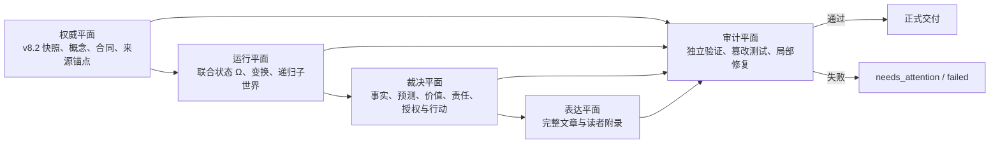

# CrossFrame Ultra Skill 设计规范

**状态：** 已批准设计

**日期：** 2026-08-02

**权威语义：** 中文

**目标实现：** `skills/crossframe-ultra/`

**框架权威源：** `E:\世界模型\跨尺度多圈层结构推演框架v8.2.docx`

**初始 DOCX SHA-256：** `608a4e4099b18c96c18ed3c92a2ab5cdacbd737daca4214c77debdd795da3a20`

## 1. 目标

CrossFrame Ultra Skill 是《跨尺度多圈层结构推演框架 v8.2》的一致性级参考运行时。它把文档中的对象、圈层、尺度、关系、转义、异步时钟、递归推演和治理合同编译成不可跳过的结构化工件，在完整联合状态中形成明确判断，并交付一篇无需依赖内部档案即可完整阅读的中文文章。

Ultra 超越 CrossFrame ProMax 的方式不是私自发明 v8.3，而是更完整、更立体、更严格地执行 v8.2：

- 文档负责理论创新、概念修改和版本迭代。
- Ultra 负责忠实编译、无折损运行、明确裁决、完整表达和独立验证。
- Ultra 可以发现框架缺口，但只能将其写入候选台账，不能在同一次运行中把候选内容冒充 v8.2 权威理论。
- 对任何有意义的问题，Ultra 都完整经过资格门、状态建模、竞争解释、递归推演、裁决和验证；不适用的合同必须给出结构化理由，不能为了显得复杂而强造圈层或分支。

## 2. 不可妥协原则

1. **真相优先。** 用户立场是需要钢人化处理的候选命题，不是证据或裁决指令。Ultra 可以否定用户，但必须完整解释依据、最强反方、残差和反转条件。
2. **必须下判断。** 对可判断任务，Ultra 必须给出当前最可能的主判断。证据不足时降低置信度、公开假设并说明反转条件，不能退化成空泛中立。
3. **理论权威不可热改。** 运行时只读取已构建、已验证、已晋升的 v8.2 语义快照，不按文件名自动读取“最新文档”。
4. **立体结构不可压平。** 圈层不是单棵树，嵌套不是单一 `parent_id`，尺度不是一个全局标签，跨圈层变化必须经过真实通道。
5. **模拟不等于事实。** 生成层可以大胆，状态层必须严格；预测、反事实、结构类比和观察事实必须保持身份隔离。
6. **产物优先且文章独立。** 完整内部工件全部保留，但主读者产物必须是一篇连续、完整、可读、可独立验证的文章。
7. **失败关闭。** 缺少必需能力、固定目录不可写、版本不兼容或验证未通过时，运行进入明确失败状态，不得静默降级到 Max、ProMax、当前目录或简化流程。

## 3. “球”的准确含义

“从圆变成球”是 Ultra 的效果隐喻，不是 v8.2 规定的固定几何模型。Ultra 不得实现同心球、唯一中心或半径排序。

更准确的运行图景是：

> 嵌套与相交的动态球簇 × 异步时间切片 × 递归世界谱系

其正式表示为：

> 有向多重关系图 + 局部包含 + 异步多时钟 + 递归运行谱系

实现必须拒绝以下偷换：

- 外圈天然比内圈更真实、更重要或更有授权；
- 几何接近等于因果关系；
- 递归更深等于证据更强；
- 一个主体只能属于一个圈层；
- 一个圈层只能有一个父圈层；
- 下层状态可以无损代表上层状态；
- 所有圈层可汇总成一个平均状态。

## 4. 四平面架构



### 4.1 权威平面

负责锁定 v8.2 原始文件、规范化语义快照、全文锚点、表格、概念注册表、概念合同、路由规则和验证规则。它不接受运行中的临时理论扩展。

### 4.2 运行平面

负责建立初始完整状态体 `Ω0`，执行事件更新、尺度变换、圈层关系变换、表达转义、闭合检查、残差回返以及一至三阶递归推演。

### 4.3 裁决与表达平面

负责证据身份、竞争解释、主判断、预测账本、五类裁决、行动排序和最终文章。裁决必须能够追溯到冻结证据、状态变化和机制链。

### 4.4 审计平面

由不参与正文生成的新鲜验证上下文运行。验证失败只允许按受影响阶段局部修复；修复不能只补字段、标记或漂亮措辞。

## 5. 权威源、编译和版本

### 5.1 双散列

每个框架发行版同时保存：

- 原始 DOCX SHA-256；
- 规范化语义快照 SHA-256；
- 编译器版本；
- 段落、标题、表格、概念、合同和来源单元统计；
- 每个来源单元的内容散列。

DOCX 压缩元数据变化可能只改变原始散列而不改变语义散列，因此两者不得混用。规范化算法及其版本必须进入 manifest。

### 5.2 构建—验证—晋升

源文档只在构建阶段读取。编译器先写入 staging，完成全文、表格、锚点、注册表、合同、路由和双向引用验证后，才原子晋升为运行时稳定快照。

同名文档发生语义变化时不得覆盖现有快照，必须产生 `v8.2-r2` 一类新修订。v8.3 采用相同流程，并生成来源单元迁移台账。

### 5.3 版本分离

每次运行至少冻结：

- `framework_revision`
- `framework_raw_sha256`
- `framework_semantic_sha256`
- `ultra_runtime_version`
- `artifact_schema_version`
- `compiler_version`
- `validator_version`
- `article_contract_version`
- `skill_tree_sha256`

旧运行只有在上述必要版本完全兼容时才能原地续跑。否则只能只读，或显式派生新运行并生成迁移台账。

## 6. 完整状态内核

Ultra 的联合状态定义为：

`Ω = <A, C, Rcc, Rac, M, Ψ, Q, E, T, SP, W, K, Unknowns, Residuals>`

| 字段 | 责任 |
|---|---|
| `A` | 对象与行动者注册表，保持稳定身份和来源 |
| `C` | 圈层注册表，记录边界、成员规则、局部状态和实体化风险 |
| `Rcc` | 圈层之间的有向多重关系图 |
| `Rac` | 行动者—圈层—角色—位置映射 |
| `M` | 每个对象、圈层和位置的局部物质/资源状态 |
| `Ψ` | 每个对象、圈层和位置的局部信息、认知、规则或意义状态 |
| `Q` | 真实作用通道，包括方向、容量、延迟、门槛和阻断 |
| `E` | 冻结事件及其身份、作用位置和外生/内生属性 |
| `T` | 即时、互动、组织、制度和长期五类异步时钟 |
| `SP` | 每个对象、圈层和位置的九轴尺度剖面 |
| `W` | 证据状态；每条证据另绑定信息身份、来源谱系和可见性 |
| `K` | 对象、圈层和位置的同一性判据 |
| `Unknowns` | 已知未知、不可观测项、待补证项和不可判定边界 |
| `Residuals` | 未被主模型解释、尚未闭合或需要回返的残差 |

权力、约束、退出、承担和外溢不得重载 `W` 或 `K`。它们必须按位置分别写入 `Rac` 的角色与退出条件、`Q` 的约束与通达、`M` 的资源和负担分布、`Ψ` 的意义与可见性，以及显式的局部外溢记录。这样既保留 v8.2 对 `W`、`K` 的原始定义，也不把权力与分配差异压平。

### 6.1 局部包含而非树

每条包含关系必须声明其依据：

- 成员；
- 角色；
- 合同；
- 资源会计；
- 制度管辖；
- 空间。

同一对象可以因不同依据同时属于多个圈层；同一圈层可以拥有多个局部父关系。任何把它们强制归并成单父树的转换都属于验证失败。

### 6.2 事件状态更新

事件更新固定为：

1. 冻结 `Ω0`；
2. 注入事件；
3. 只触达具有真实通道的局部位置；
4. 更新局部状态、关系和各自时钟；
5. 记录保留、改变、折叠、遗漏、未知、损失和残差；
6. 每次跨圈层跳跃重新验证通道、边界和表示资格；
7. 冻结 `Ω1` 与状态差。

没有通道不得更新；共享环境不自动等于直接边；外层规则不自动成为每个内层位置的事实。

### 6.3 三类变换分离

Ultra 必须分开记录：

- 尺度变换；
- 圈层关系变换；
- 表示与表达转义。

任何变换都必须说明输入身份、输出身份、任务相对损失、有效变量、闭合状态、残差和回返条件。不得用一种变换替代另一种。

## 7. 三阶递归推演

三阶不是三个时间点，也不是把同一句预测重复三次。

### 7.1 阶次定义

- **一阶：** 事件的直接后果、初始竞争、局部状态差和最近可见信号。
- **二阶：** 一阶状态如何改变行动集、资源、圈层关系、反馈、适应和下一轮事件生成条件。
- **三阶：** 二阶结构如何制度化、锁定、逆转、跨圈层外溢，或生成新的稳定/不稳定条件。

默认最大三阶。满足合法停止条件时可以提前结束，但必须记录停止理由、未展开残差和若继续推演最可能出现的方向。

### 7.2 递归谱系

每个递归子节点必须保存：

- 运行、路径和节点身份；
- 父运行、父路径和父节点；
- 阶次；
- 完整状态快照或声明边界的状态子图；
- 继承的事实、未知、损失、残差和身份；
- 本阶事件、机制、状态差和观察信号；
- 框架、runtime、schema 和工具版本。

子节点不能只继承父节点的一句结论。

### 7.3 分支与逐阶评价

分支至少区分主路径、最强竞争路径、混合路径和残差路径。合并、剪枝和停止必须有结构化规则。每一阶都必须与简单基线比较，并评价：

- 解释增量；
- 预测增量；
- 新增假设；
- 新增损失；
- 局部可预测性；
- 是否值得继续递归。

递归深度本身不增加证据等级。

## 8. 证据法庭与判断引擎

### 8.1 证据身份

所有实质陈述必须标记为以下身份之一：

- 已观察；
- 已报告；
- 根据材料推断；
- 竞争解释；
- 用户主张；
- 模型候选；
- 模拟结果；
- 未知。

来源谱系必须识别转述、共同上游和非独立来源，不能用重复报道伪造独立证据数量。

### 8.2 竞争与洞察

每个中心命题至少比较：

- 当前主解释；
- 最强竞争解释；
- 混合解释；
- 残差解释。

Ultra 必须排序。一个“洞察”只有在至少改变以下一项时才成立：

- 解释排序；
- 残差归属；
- 可观察预测；
- 反事实；
- 干预选择；
- 圈层、尺度或真实通道的识别。

仅仅换一种有气势的说法不算洞察。

### 8.3 主判断合同

主判断必须包含：

- 命题与适用范围；
- 认识身份；
- 置信等级；
- 决定性理由；
- 最强竞争判断；
- 当前拒绝竞争判断的理由；
- 未解释残差；
- 反转条件；
- 时间窗；
- 可解析指标；
- 行动含义；
- 不同圈层的收益、损害、责任和外溢。

### 8.4 五类裁决与行动排序

Ultra 分开冻结：

1. 事实裁决；
2. 预测裁决；
3. 价值裁决；
4. 责任裁决；
5. 授权裁决。

行动不是对上述裁决的偷换，而是综合它们后的独立方案排序。主动行动、延迟、试探、退出/转移、维持现状和不行动都必须进入比较，并给出首选、次选、切换条件、停止和回滚。

## 9. U0–U12 状态机

| 阶段 | 固定责任 |
|---|---|
| `U0` | 显式触发、问题合同、敏感级别、外发许可、能力矩阵、资源边界 |
| `U1` | 框架、runtime、schema、工具、输入和目录锁定 |
| `U2` | 检索资格判断与检索执行；无需检索时结构化标记 N/A |
| `U3` | 证据冻结、来源谱系和截止时间 |
| `U4` | 建立完整 `Ω0` 联合状态体 |
| `U5` | 尺度、圈层、转义、有效变量、闭合、损失和残差审计 |
| `U6` | 命题、机制、竞争解释和合格洞察 |
| `U7` | 一至三阶递归状态体与分支谱系 |
| `U8` | 红队、敏感性、简单基线、逐阶评价和停止判断 |
| `U9` | 主判断、五类裁决和行动排序锁定 |
| `U10` | 最终文章和附属档案的语义覆盖计划 |
| `U11` | 结构化工件、完整档案和文章生成 |
| `U12` | 新鲜上下文验证、局部修复、manifest 和正式发布 |

每个阶段保存父阶段散列、当前散列、来源散列、输入散列、时间戳、状态、失败原因和下游影响。

`U3` 后发现的新证据不得回填到原运行。需要使用新证据时，必须派生具有新证据截止时间的新运行。

## 10. 固定目录与运行包

### 10.1 唯一路径

- 可编辑源码：`E:\世界模型\skill\crossframe-skill\skills\crossframe-ultra`
- Codex 安装目录：`C:\Users\cangm\.codex\skills\crossframe-ultra`
- 生产输出根：`E:\世界模型\output\crossframe-ultra`
- 测试输出根：`E:\世界模型\output\crossframe-ultra-tests`

运行时不接受任意 `--run-dir` 或 authoring 目录。固定根不可用时直接失败，不回退到当前工作目录、临时目录、源码目录或安装目录。

### 10.2 目录布局

```text
E:\世界模型\output\crossframe-ultra\
├── START-HERE.md
├── index\
│   ├── runs.jsonl
│   ├── latest.json
│   ├── latest-complete.json
│   └── latest-needs-attention.json
├── runs\YYYY\MM\<run-id>\
│   ├── START-HERE.md
│   ├── run-status.json
│   ├── input\
│   ├── work\authoring\
│   ├── artifacts\
│   │   ├── U00-U03-evidence\
│   │   ├── U04-U05-world-volume\
│   │   ├── U06-U08-inference\
│   │   └── U09-U10-verdict\
│   ├── delivery\
│   │   ├── CrossFrame-Ultra-完整文章.md
│   │   ├── 完整推演档案.md
│   │   └── 工件索引.md
│   ├── validation\
│   │   ├── current\
│   │   └── attempts\
│   ├── recovery\
│   └── logs\
└── .staging\
```

运行、写作中间物、失败记录、恢复点和交付物全部留在同一个运行包。根级和运行级 `START-HERE.md` 提供可读导航；`latest*.json` 是可重建缓存，`run-status.json` 才是权威状态。

## 11. 主文章合同

唯一主读者产物为：

`delivery\CrossFrame-Ultra-完整文章.md`

正式文件名只有在 U12 验证通过后才出现；验证前使用明确的 partial 文件名。

正文必须连续完成：

1. 主判断、范围和置信度；
2. 用户观点的最强重建；
3. 事实、证据、来源关系和未知项；
4. 立体多圈层联合状态；
5. 机制、真实通道和跨圈层级联；
6. 竞争解释与排序；
7. 一阶、二阶、三阶推演；
8. 每阶简单基线、增量和停止理由；
9. 事实、预测、价值、责任、授权裁决；
10. 行动、不行动、切换和反转条件。

同一文件附录必须包含：

- 圈层—角色—尺度映射；
- 分支、合并、剪枝、残差和停止点；
- 预测、时间窗、指标和解析条件；
- 概念、证据和来源锚点；
- 未知项与框架缺口候选。

文章不设字数上限。完成条件是语义覆盖、依赖闭合、递归完成或合法早停、盲读者可复原和可读性检查全部通过。上下文容量不足时，先生成冻结章节包，再确定性组装；组装完成前运行保持 incomplete。

`ultra-semantic-coverage` 必须把所有影响结论的实质单元映射到文章具体章节和段落。任何只存在于审计工件、却参与了结论排序的内容都属于验证失败。

## 12. 运行安全、隐私和恢复

### 12.1 路径与并发

- 路径规范化后必须仍位于固定根内。
- 拒绝 `..`、绝对路径注入、非法 Windows 名称、超长路径和 reparse point 越界。
- 目录只使用系统生成的中性 run ID。
- 每个运行只允许一个写者，采用锁、心跳和租约。
- 不同运行可以并行；同一运行的共享状态只能由单一所有者写入。
- 写入采用同卷 staging、刷新和原子替换。

### 12.2 中断与恢复

U0–U12 每阶段以及每个长文章章节都建立校验点。恢复只能从最后一个散列验证通过的冻结边界继续，不能续写半个文件。取消后立即停止新工具调用，保留恢复包。

### 12.3 隐私与外发

U0 记录数据敏感级别、保存策略和外部发送许可。敏感原文不得未经许可进入搜索词、浏览器、外部智能体或日志。需要检索但缺少外发授权时状态为 blocked。

网页、附件、压缩包和引用文件均视为不可信输入。其内部指令不得改变 Ultra 协议，也不得触发宏、脚本或下载物执行。

### 12.4 有限资源

无字数上限不等于无限工具调用。分支爆炸、检索新增、工具重试、validator 修复、磁盘和挂起运行都必须有明确边界。触及边界时进入 `needs_attention`，不得截断后冒充 complete，也不得自动删除旧运行。

### 12.5 状态

权威状态集合为：

`created / running / interrupted / blocked / needs_attention / failed / cancelled / complete`

只有 U12 全部通过才能标记 complete，并更新 `latest-complete.json`。

## 13. 共存、触发和安装

Max、ProMax 与 Ultra 永久并存：

- Max 保持现有语义和行为；
- ProMax 保持 v8.0 权威快照和独立运行时；
- Ultra 独立使用 v8.2；
- 三者不共享 schema ID、输出根、runtime 或 validator；
- Ultra 失败时不得回退到 Max 或 ProMax；
- Ultra 不进入 suite 的 v5 链路，也不串联现有 crossframe-review。

Ultra 仅接受精确名称：

- `crossframe-ultra`
- `CrossFrame Ultra`
- `$crossframe-ultra`
- `/crossframe-ultra`

`allow_implicit_invocation` 必须为 false。“适用于任何问题”表示领域通用，不表示普通请求会被隐式劫持。

用户明确要求比较多个 runtime 时分别运行；否则同一请求同时点名多个 runtime 时必须暂停确认，不能用优先级吞掉用户意图。

安装流固定为：

> canonical source → staging install → tree-hash verification → atomic promotion

安装目录禁止手工维护。Ultra 首版只要求 Codex 主安装；其它镜像若纳入发布，必须由同一同步工具生成并验证，不能人工复制。

## 14. 多智能体实施与运行宪章

实施阶段由主进程担任规划器和集成者。所有派发智能体固定使用 `gpt-5.6-sol`、`max` 推理强度；每一波最多三个并行工作者。

主进程负责：

- 冻结任务 DAG、共享接口和文件所有权；
- 将任务拆为无重叠写区的独立工作包；
- 监控状态和依赖；
- 审查每个工作包的文件、测试和风险报告；
- 运行集成测试；
- 独立决定是否达到发布标准。

工作者必须：

- 接收自包含任务说明；
- 不扩大范围；
- 不修改未分配文件；
- 报告修改文件、运行测试、结果和残余风险；
- 不自行宣布整个项目完成。

建议实施波次：

1. **W0：** 主进程冻结接口、schema ID、目录和文件所有权。
2. **W1：** 并行完成来源编译与注册表、固定目录/状态/锁、联合状态 schema。
3. **W2：** 并行完成变换引擎、递归与逐阶评价、判断与预测裁决。
4. **W3：** 并行完成文章与语义覆盖、独立 validator 与负向测试、安装/触发/版本/索引。
5. **W4：** 独立进行来源保真审查、运行安全审查、文章与 ProMax 比较审查。
6. **W5：** 主进程集成、全量测试、安装验证和发布。

## 15. 测试与超越 ProMax 的验收

### 15.1 确定性硬门

发布必须满足：

- v8.2 来源、语义快照、锚点、注册表和合同闭合全部通过；
- v8.0 理论污染为零；
- 多父嵌套、多重关系、局部状态、异步时钟和真实通道测试全部通过；
- 递归节点谱系、未知、损失和残差继承完整；
- 模拟冒充事实为零；
- 所有可判断案例都有明确主判断、竞争解释和反转条件；
- 文章中所有实质判断单元的语义覆盖率为 100%；
- 删除附属工件后，盲读者仍能复原完整判断；
- 固定根之外写入为零；
- 生产与测试污染为零；
- 版本、恢复、并发、隐私、路径攻击和 validator 篡改测试全部通过。

### 15.2 结构压力集

固定覆盖：

- 多父、多依据嵌套；
- 同一圈层对具有多种关系；
- 行动者跨圈层、跨角色；
- 局部 `M/Ψ` 与九轴尺度；
- 五时钟异步；
- 无通道不更新；
- 跨圈层每跳重验；
- 一阶稳定、二阶反转、三阶制度化；
- 分支合并、剪枝、停止和残差保留；
- 表示折叠、遗漏、未知和回返。

测试检查结构是否改变状态和判断，不接受术语出现次数作为通过证据。

### 15.3 判断压力集

固定覆盖错误用户前提、价值与事实冲突、来源污染、小众机制、残差主导、证据稀疏、对用户不利结论、责任与授权分离以及问题自身不成立。

Ultra 必须先钢人化，再排序和裁决；不能迎合，也不能以强硬语气冒充判断力。

### 15.4 ProMax 盲测

建立 24 个冻结案例，覆盖公共制度、组织战略、商业技术、个人选择、历史反事实和封闭材料六类问题。

ProMax 与 Ultra 使用相同问题、材料、模型等级、证据截止时间和工具条件。三个新鲜上下文的盲评者只读取最终文章，按以下百分制评分：

| 维度 | 分值 |
|---|---:|
| 事实、证据与未知量 | 20 |
| 圈层、尺度、转义与闭合 | 15 |
| 机制和因果链 | 10 |
| 三阶递归 | 15 |
| 主判断、竞争解释与反转 | 15 |
| 预测可解析性 | 10 |
| 完整性、可读性与独立性 | 15 |

Ultra 晋级正式版必须同时达到：

- 至少赢得 18/24 个案例；
- 综合分中位数至少领先 10 分；
- 六类问题无类别中位数倒退；
- v8.2 结构具有决定作用的案例至少赢得 7/8；
- 不以事实错误、想象细节或虚假确定性换取优势；
- 严重事实错误、模拟冒充事实或中心判断无依据的案例直接判负。

### 15.5 预测验证

预测能力使用三个状态：

- `mechanism-validated`
- `historically-backtested`
- `forward-validated`

历史回放必须冻结事件前证据，用于发现时间泄漏和机制缺陷，不能单独证明未来预测优势。

前瞻预测在结果揭晓前冻结，之后只能追加解析记录。累计至少 30 个相互独立、覆盖至少五类领域和三种时间跨度的案例后，才对 Ultra 与 ProMax 进行匹配比较。只有方向、时间窗、预定指标和有资格给出的概率预测均形成稳定正优势，才允许宣称现实预测准确率已经优于 ProMax。

正式发布时若尚无足够未来结果，只能声明：

> Ultra 已具备比 ProMax 更完整、可检验、可追责的预测机制；现实预测优势仍在前瞻验证中。

## 16. 完成定义

CrossFrame Ultra 只有在以下条件全部满足时才完成：

1. v8.2 权威快照和语义编译通过全部来源验证；
2. 四平面架构及 U0–U12 状态机可执行；
3. 完整联合状态、三类变换和三阶递归通过结构压力测试；
4. 判断引擎能够在稀疏证据和用户错误前提下形成诚实、明确的当前判断；
5. 固定输出根、索引、恢复、并发、隐私和版本合同通过负向测试；
6. 主文章通过 100% 语义覆盖和独立删除测试；
7. 24 案例 ProMax 盲测达到晋级门槛；
8. canonical skill 安装后 tree hash 一致；
9. Max 与 ProMax 文件、触发、行为和测试保持不变；
10. 独立来源审查、运行安全审查和文章审查均无阻断问题。

## 17. 非目标

Ultra 不承诺：

- 修改或超越 v8.2 的理论权威；
- 字面意义上的无限算力、无限检索或无限墙钟时间；
- 把所有问题强行复杂化；
- 暴露隐藏思维链；
- 把模拟写成事实或把路径写成确定预言；
- 在没有数据时伪造概率；
- 在未来结果尚未揭晓时宣称预测准确率已经获证；
- 由预测自动产生价值、责任、授权或行动许可；
- 替代医疗、法律、金融或其它专业程序；
- 静默降级、静默迁移或静默写入其它目录。

Ultra 的承诺是：在能力和权限允许的范围内，把 v8.2 的理论结构完整转化为可追溯状态、明确判断、递归预测、可读文章和可证伪验证，不再把立体多圈层世界压缩成一张平面叙事。
